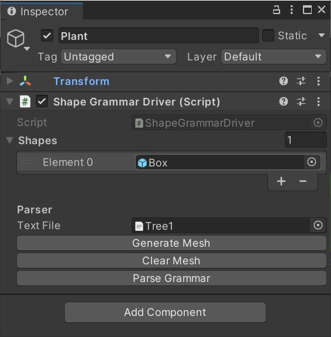

# ShapeGrammarLanguage

Shape Grammar Language (SGL) is a visual scripting language written for Unity Game engine. It allows complex self similar objects to be encoded as a set of rules describing the transforms of simpler shapes. Designing Shape Grammars is about breaking down a model into components that can be repeated. Rooms in a building or branches of a tree are examples of this. Find out more about shape grammars [here](https://cosmicpotato.tech/res/documents/Procedural_architecture_using_grammars.pdf).

## Installation

See see the [documentation](https://docs.unity3d.com/Manual/upm-ui-giturl.html) on how to install Unity packages from GitHub. 
When adding this package to Unity use the following link:

```https://github.com/msunde137/ShapeGrammarLanguage.git```

## Writing Your First Grammar

Shape grammars are composed of a set of primitive solids, and a lists of operations called production rules for how to manipulate and place those solids in 2D or 3D space. Production rules are similar to functions as they can be nested, called recursively, and take in parameters.
Here is an example Shape Grammar file.

```
#define MAx_DEPTH 10
#var translate 5

%%
start()[] : { continue() }

continue()[] : {  T(0, translate, 0) S(1, 5, 1) R(0, 45, 0) PlaceShape(“Box”) continue() }
```

This grammar will move up 5 units, scale up by 5 units, rotate 45 degrees, and place a cube, and repeat this process for 9 iterations. MAX_DEPTH refers to the maximum depth of recursive calls that can be made when producing a gramamr. Recursion happens when start() or continue() makes a call to continue(), so one recursive step is used to reach continue() from start(). In SGL terms, start() and continue() are called a production rules. All operations occuring between the brackets are generator rules. Generators can be geometric operations like T, R, S, PlaceShape, or calls to other production rules. 

### File Format

Shape Grammar files are text files formatted with a list of preprocessor definitions at the top followed by a list of production rules separated by a break token (```%%```). SGL starts production with the first production rule in each file, regardless of the name. This means that the first rule must not have any parameters, as their values would be undefined at the start of production. 

### Shape Grammar Driver

Once you have your first grammar, it is run by unity using the ShapeGrammarDriver script. The list of shapes contains all prefabs which shape grammars, specifically the PlaceShape generator has access to. The Shape Grammar file is input in the text file field.



## Language Features


### Static Variables

There are two types of static variables in SGL. The first are production definitions. These are defined using the ```#define``` keyword, and must be one of the following: 

- ```MAX_DEPTH```: the maximum recursive depth of the Shape Grammar.
- ```MAX_OPER```: the maximum number of generator operations allowed before termination.
- ```SEED```: the seed for all randomness. If left out, the seed will change each time the Shape Grammar is produced. 

The second type are variables defined using the ```#var``` keyword. These can be used in the rest of the grammar as constant values. Currently SGL supports integers, floats, strings, and booleans as data types and all types are dynamically cast at the time of generation. 

### Parametrization

Parameters can be passed between different production rules in the same way as traditional functions. The Production rule:

```branch(l)[] : { T(0, l / 2, 0) SS(1, l, 1) PlaceShape("Cylinder") }```

places a cylendar at a distance of ```l / 1``` and a scale of ```l```. Be aware that all types are cast dynamically.

### Contitionals

Production rules can be turned off and on using conditions. 

### Randomness

## Tips and Tricks

### Pseudo-if-statements


